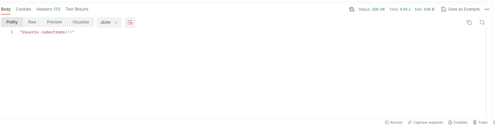

# My-Shop: AWS Serverless Microsservices
 My-Shop é uma aplicação distribuída implementada utilizando a arquitetura de microsserviços e serverless, que tem como objetivo gerenciar um comércio web fictício com três microsserviços: User-app para usuários, Inventory-app para estoque e Payment-app para pagamentos, cada microsservirço é composto por um conjunto de funções serverless e seu próprio banco de dados. Os microsserviços foram desenvolvidos utilizando o recurso de computação em nuvem Serverless, com serverless é possível construir e implantar aplicações na nuvem sem ter que gerenciar nenhuma infraestrutura. Desta forma utilizamos a plataforma Amazon AWS para implantarmos nossa aplicação e utilizamos a linguagem Python e o framework AWS Sam para a implementação e testes da aplicação. Com o Framework AWS Sam é possível implementar e testar aplicações serverless para a AWS localmente.

 # Arquiterura da aplicação

  .png)
 
 # Configurando o ambiente para a execução do Projeto
 Para rodar a aplicação  você primeiramente precisa ter uma conta ativa na Plataforma Amazon Aws.

 ## Requisitos da Aplicação

- Ter uma conta na AWS
- Instalar Python3 
- Instalar o docker
- Intalar o AWS SAM CLI

Para a instalação do AWS SAM CLI você pode seguir a documentação disponibilizada pela a AWS seguindo o seguinte link: https://docs.aws.amazon.com/serverless-application-model/latest/developerguide/install-sam-cli.html

## Rodando a Aplicação localmente

Se você já tiver confifigurado corretamente o ambiente de execulção, podemos execultar localmente a aplicação, para isso voce deve abrir a pasta de cada um dos microsserviços e abrir um terminal dentro de cada pasta do microsserviço e execultar o seguinte comando.
    
    . exec.sh
    
Esse comando execulta um arquivo sh que é responsavel por configurar e execultar os microsserviço e as suas funções serverless e seu banco de dados.

Se tudo ocorrer bem para cada microsservirço você deve obter em seu terminal uma saida como essa:

 

Com isso você obtem os link para a invocação de cada uma das funções do microsserviços. Desta forma voce pode utilizar alguma ferramenta de envio de requisições para testar a aplicalção.

## Testando a Aplicação:

Para testar a execulção da aplicação podemos utilizar a ferramenta Postman, para enviar requisições a nossa aplicação.

## Exemplo de Teste da Função Create-User utilizando a ferramenta Postman:
- Exemplo de Entrada

- Saida

